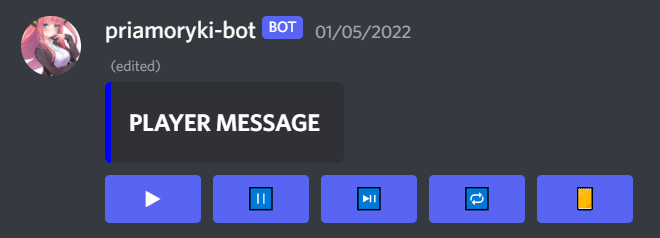
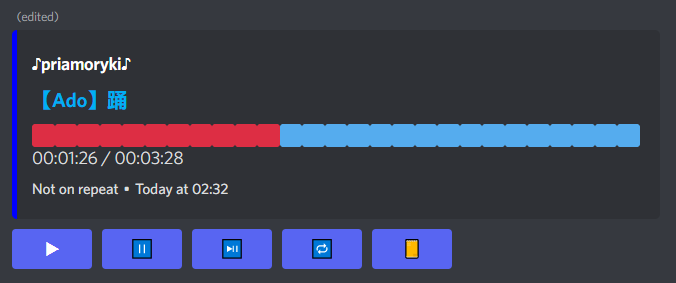

# priamoryki-bot (Discord-Bot template)

[INVITATION LINK](https://discord.com/oauth2/authorize?client_id=848999847229915147&permissions=2167532560&scope=bot%20applications.commands).

## Bot work examples

`Idle player message`:  
  
`Running player message`:  
  

## Create bot instance based on template

* Clone this repo
* Setup `data/config.json` with your bot info
* Set environment variables
    ```cmd
    export TOKEN = "BOT TOKEN"
    export SPOTIFY_CLIENT_ID = "SPOTIFY CLIENT ID FROM SPOTIFY API"
    export SPOTIFY_CLIENT_SECRET = "SPOTIFY CLIENT SECRET FROM SPOTIFY API"
    ```

## Code structure

[Main](src/main/java/com/priamoryki/discordbot/Bot.java)

## Q&A

* Can I make my own bot based on this template?
  * Yes, you can. Read more [here](#create-bot-instance-based-on-template).
* I found an issue. How can I report it?
  * Create new issue [here](https://github.com/priamoryki/priamoryki-bot/issues).
